1. Struktur Folder dan File yang ada di Folder "project_uts_hendra"

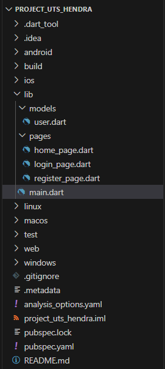

2. Membuat file main.dart, kemudian isi sintaks atau kode seperti berikut
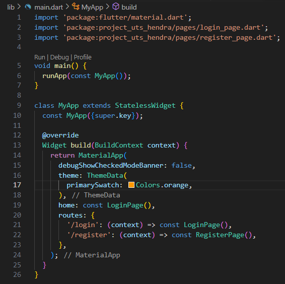

3. Membuat folder models, kemudian membuat file user.dart di dalam folder models
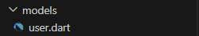

4. Isi sintaks atau kode user.dart seperti berikut
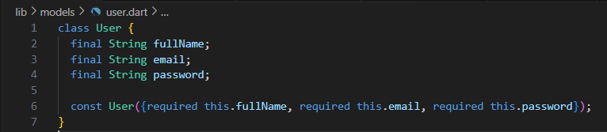

5. Membuat folder pages, kemudian membuat file "register_page.dart", "login_page.dart", dan "home_page.dart" di dalam folder pages
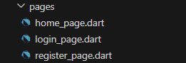

6. Isi sintaks atau kode register_page.dart seperti berikut
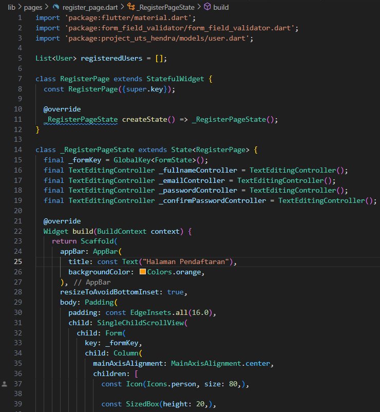

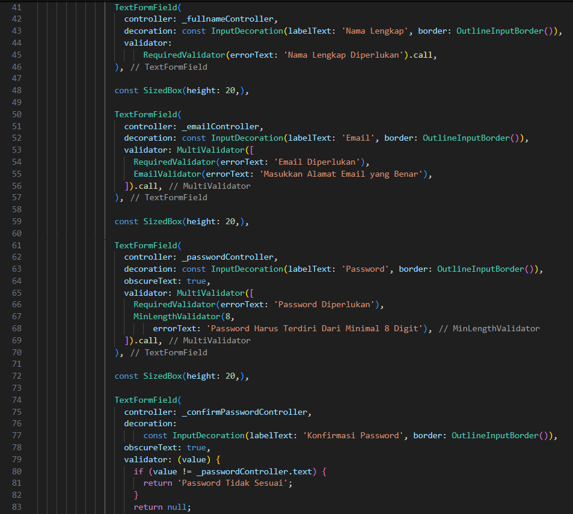

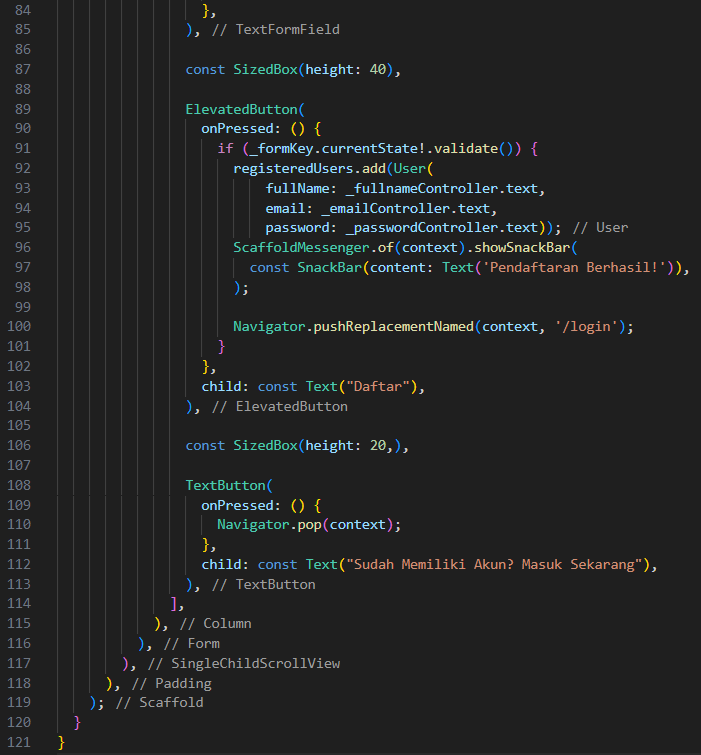

7. Isi sintaks atau kode login_page.dart seperti berikut
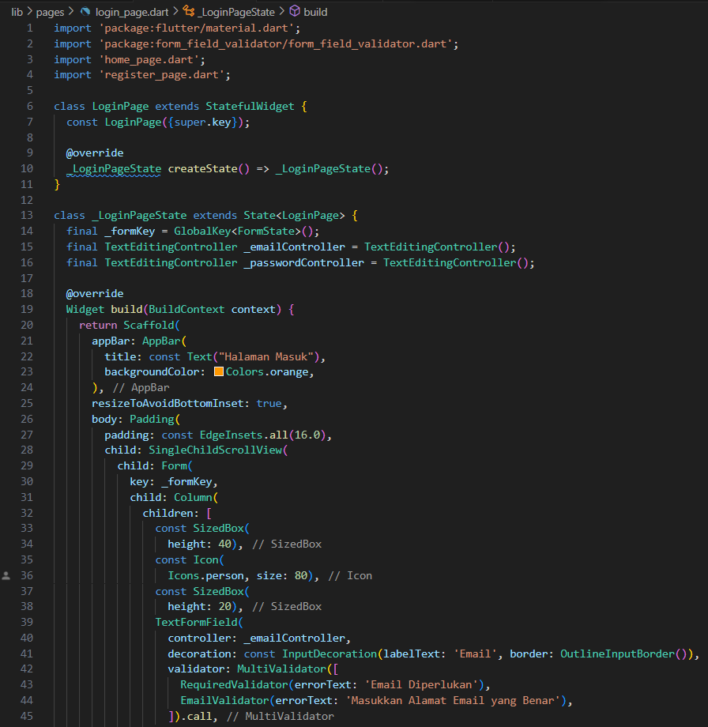

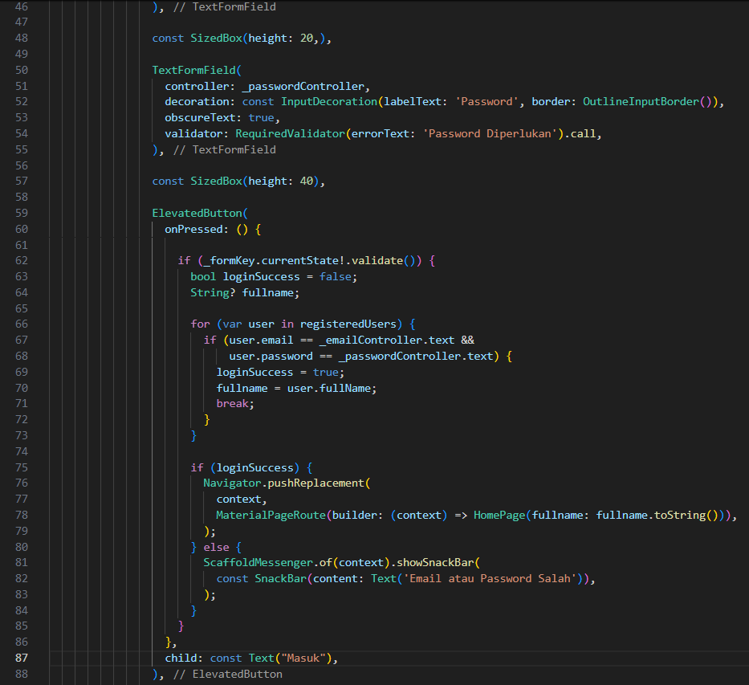

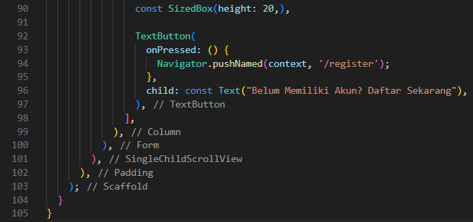

8. Isi sintaks atau kode home_page.dart seperti berikut
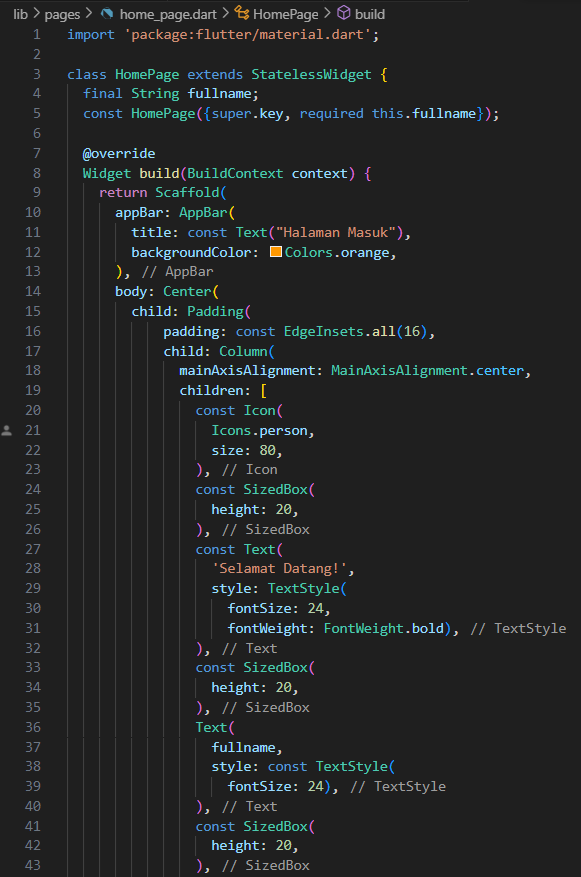

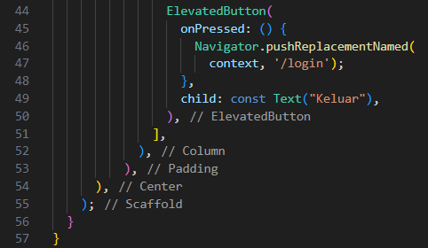

9. Ini adalah tampilan halaman pendaftaran
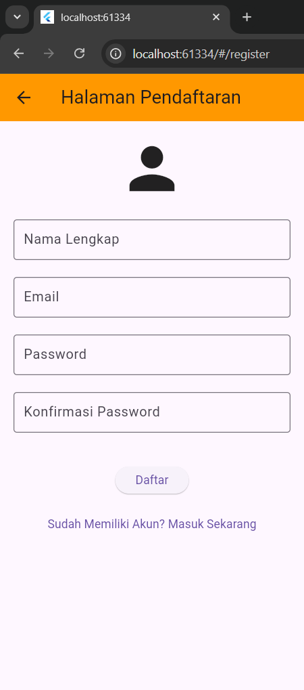

10. Ini adalah tampilan halaman masuk
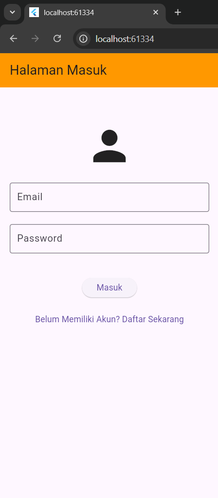

11. Ini adalah tampilan halaman beranda atau setalah halaman masuk
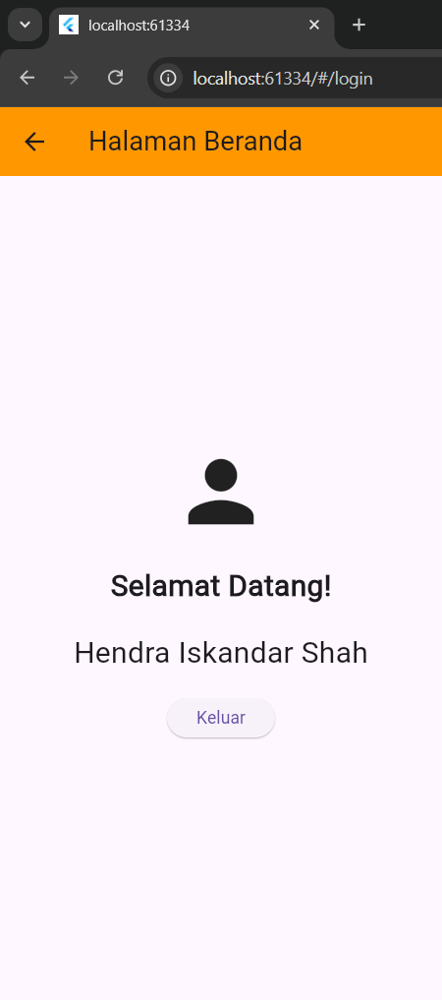

12. Ini adalah contoh mendaftarkan memasukkan alamat email tidak sesuai
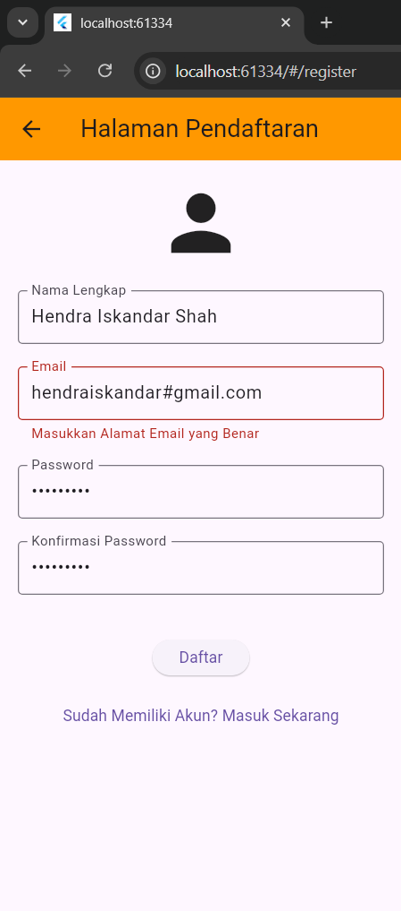

13. Ini adalah contoh mendaftarkan memasukkan password tidak sesuai
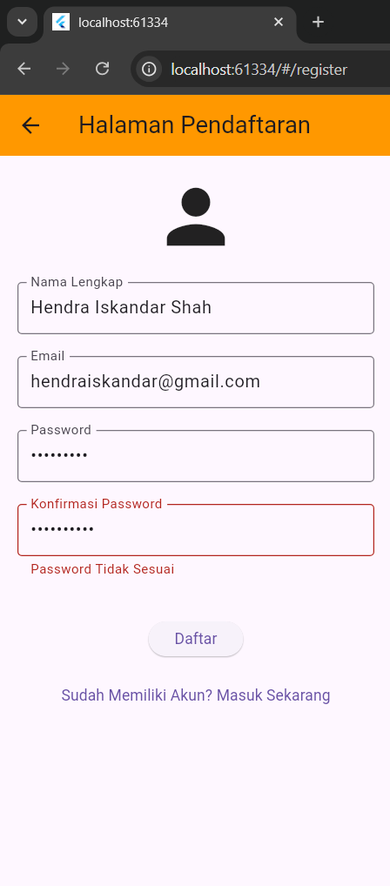

14. Ini adalah contoh mendaftarkan akun berhasil dengan baik
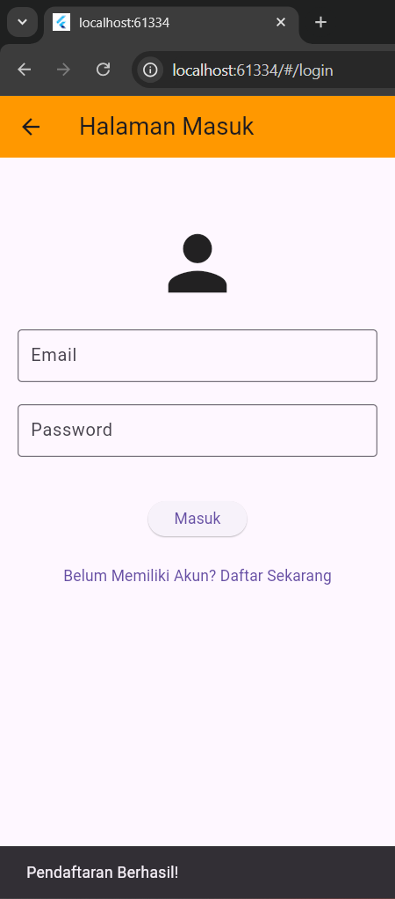

15. Terakhir kita masukkan alamat email dan password yang sudah kita buat
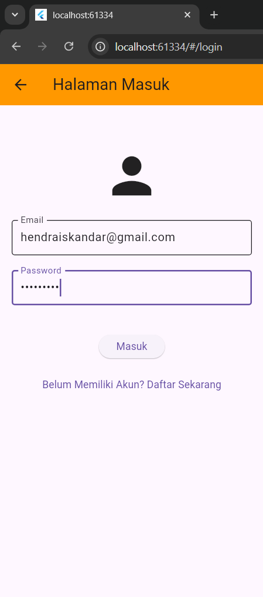

16. Dan ketika kita sudah berhasil masuk, halaman akan masuk ke halaman beranda
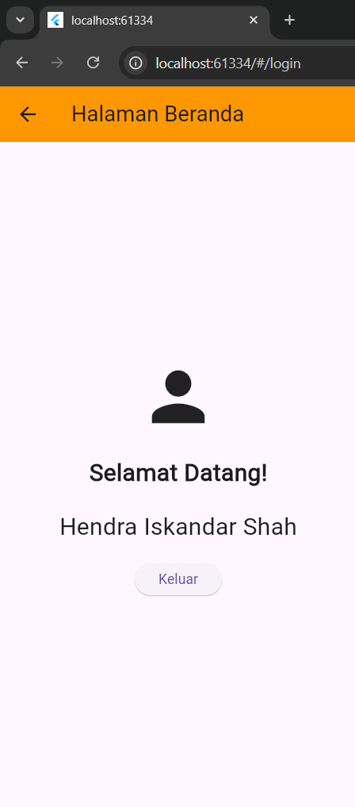